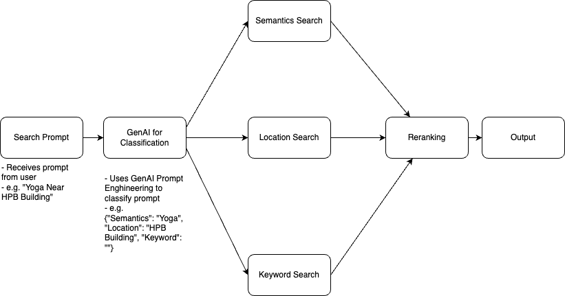

# Event Search Optimization
To start, run `pip install -r requirements.txt`

## Data Preparation
- Run `create_lat_long.ipynb"
- Followed by `create_embedding.ipynb"

## To run Frontend and API
- streamlit run frontend/app.py
- uvicorn backend.api:app --reload

## Architecture

